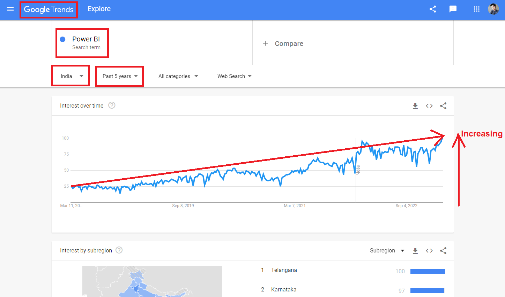
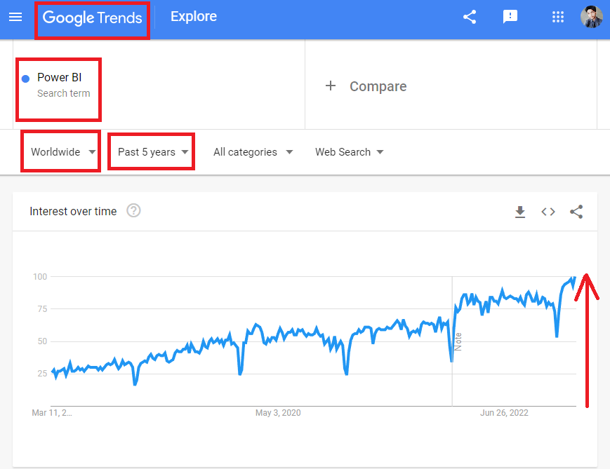
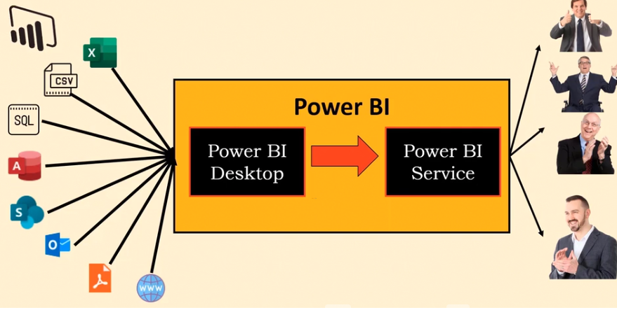

# powerbi

**Q. What is Power BI?**
-  It can be defined in two ways:

    1. Power BI is a Business Intelligence Tool, which will help us **to analyse data, clean data and convert that data into visual format** where you can make various reports and different dashboards.

    2. Power BI is **a collection of components**
    
        - **Power Query** : I**t is a ETL tool which will Extract, Transform and Load the data** (or) in other language it is use to cleaning the data where we have null values, blank/empty records (or) un-clean data it will clean the data for **visualization purposes**.

        - **Power Pivot** : It is **used for Data Modeling** when you have multiple data sources, if we want to connect them and, create relationship between them we can use Power Pivot.

        - **Power View** : **It is used for Visualization**. It can help to create **250+ charts**, that can be bar charts or Donut charts or sankey charts. these **different types of charts are useful for presentation** in various reports and dashboards.

        - **Power BI Service** : It is **use to share** your work with others people across the world. It is  **helps the Users to communicate with each other via that reports**.

**Q. Why Power BI?**
- There some top five reason why should we go with Power BI :

1. **Search Volumne in Google**, there is Google Trends platform which gives the "Interest Over Time" for any search item. let's search there about Power BI

In India :

Worldwide :

2. **Maximum Features** : It provides maximum number of features, on comparing with other tools available in the market, you can find 1200 different functions like M-function and DAX functions, we can create 280 visuals and different charts using Power BI.

3. **Cost of Power BI** : It is the cheapest amponts other tools available in the market.

4. **Data Connectivity** : It has a capability to import data from 100 data sources and It can pull data from structured  and un-structure data sources.

**Q. How Poer BI Works?**

- let's considered Power BI as a package, then we can divide Power BI into two parts - 

    1. **Power BI Desktop** : it is developer tool or desktop application which can download and install in your local machine.

    2. **Power BI Service** : It is a online/cloud version and specifically, for sharing and collaborating purposes.

    
